# New Claims List & Claims To Set Up VBA Guide

Two Outlook VBA trackers that turn claim-related emails into living Excel to-do lists.

- **New Claims**: extracts Claim Number, Date Received, Insured, and Adjuster from "New Task To Assign" emails. Appends new rows and skips duplicates by Claim Number.
- **Claims to Setup**: extracts unique email subjects (RE:/FW:/FWD: stripped) and Date Received. Appends new rows and skips duplicates by subject.

## 1. Move relevant emails into a dedicated folder

Do this **manually** rather than with an Outlook rule as it matches the phrase anywhere in the subject, not just at the start, so they'll also catch unrelated emails that happen to contain the same words.

- Create a subfolder under your Inbox (e.g. `New Claims`).

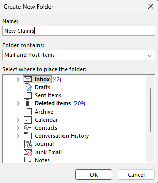

- As "New Task To Assign" emails come in, drag them into that folder.

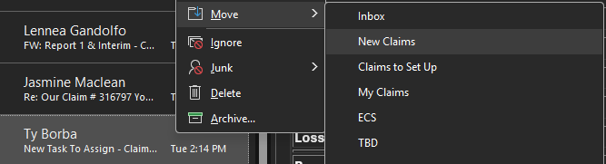

## 2. Load the VBA script

- In Outlook, press `Alt` + `F11` to open the VBA editor.
- Press `Enable Macros` if a pop up message appears.
- In the Project Explorer (left pane), right-click your project → **Import File...** → select [`NewClaimFiles.bas`](NewClaimFiles.bas) that is downloaded to your device.

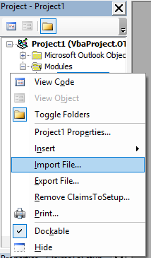

## 3. Match the script to your setup

Open the `NewClaimFiles` module and update two lines near the top of `ExtractEmailTableDataToDesktop` and near the bottom `ResetClaimsSheet` as you'd like or leave it be:

```vb
targetFolderName = "New Claims"        ' must exactly match the folder name from Step 1
```

```vb
filePath = ... & "\New_Claims_List.xlsx"   ' change the filename here if you want something different
```

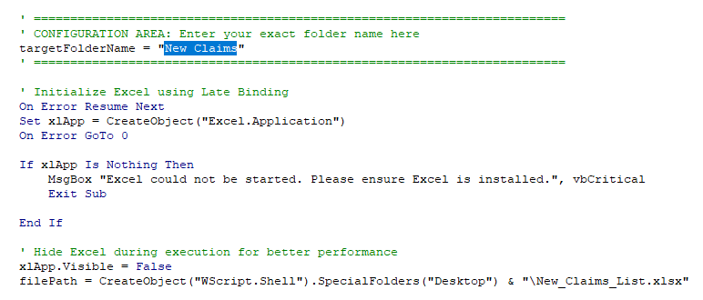
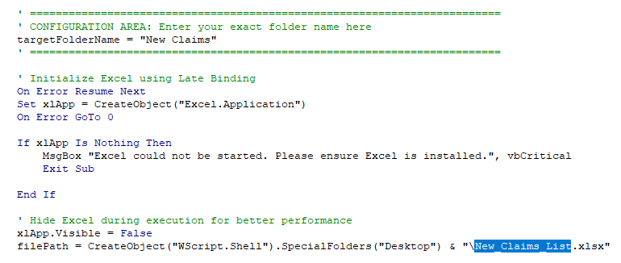
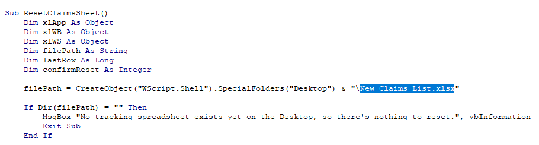

- Type `CTRL` + `s` to save any changes made

## 4. Add buttons to the ribbon

- Go back to Outlook
- **File → Options → Quick Access Toolbar**

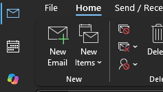
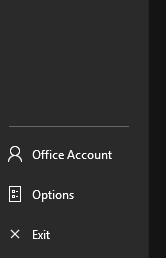
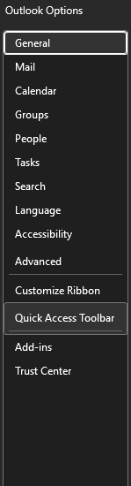

- Set "Choose commands from" to **Macros**

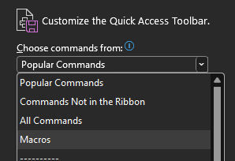

- Add `Project1.ExtractEmailTableDataToDesktop` → click **Modify** → rename to **Update New Claims List** (pick a distinct icon)
- Add `Project1.ResetClaimsSheet` → **Modify** → rename to **Reset Claims Sheet** (pick a distinct icon)

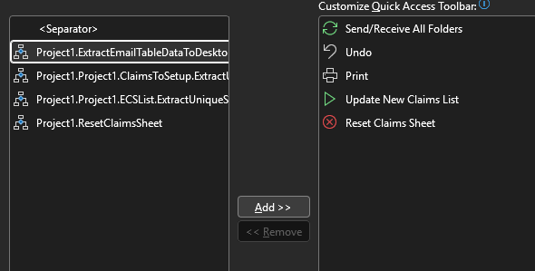

- Press OK
- The buttons should show up on the top of your screen:

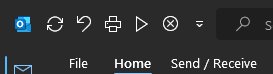

## 5. Repeat the procedure with `ClaimsToSetup.bas`
Repeat steps 1–4 with these differences:

| Item | New Claims | Claims to Setup |
|------|------------|-----------------|
| Folder name | `New Claims` | `Claims to Set Up` |
| `.bas` file | `NewClaimFiles.bas` | `ClaimsToSetup.bas` |
| Excel file | `New_Claims_List.xlsx` | `Claims_To_Setup_Data.xlsx` |
| Update macro | `ExtractEmailTableDataToDesktop` | `ExtractUniqueSubjectsToDesktop` |
| Reset macro | `ResetClaimsSheet` | `ResetClaimsToSetupSheet` |
| Button names | Update New Claims List / Reset Claims Sheet | Update Claims to Set Up List / Reset Claims to Set Up List |

Everything else (manual folder move, VBA import, Quick Access Toolbar, weekly cleanup order, known errors) is identical.

## 6. Suggested Use/ Workflow

1. At the end of each week, archive/ move the emails out of the `New Claims` and `Claims to Set Up` folder and click **Reset Claims Sheet** and **Reset Claims To Set Up Sheet**.
2. Click **Update New Claims List** and/ or **Update Claims To Set Up List** whenever a new email has been added to respective folders.

**NOTE**: Always exit out of the spreadsheet before updating or resetting the list.

Below is how the generated spreadsheet looks like, note that the highlight colors and file number are to be added manually:
- New Claims List
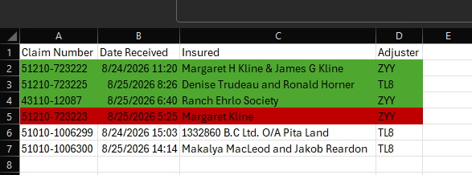
- Claims to Set Up List
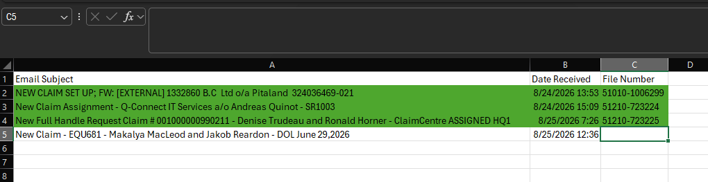


## Known errors

**Runtime error 1004 / "file is open in another application"**
A previous run didn't close Excel properly, leaving it running invisibly in the background with the file locked.
→ Task Manager (`Ctrl+Shift+Esc`) → **Details** tab → end any `EXCEL.EXE` processes → re-run the macro.

**Macros stop running after reopening Outlook**
Outlook's macro security resets each session by default.
→ **File → Options → Trust Center → Trust Center Settings → Macro Settings** → select "Notifications for all macros," then click **Enable Content** when prompted each time Outlook restarts.

**A claim doesn't show up after running the macro**
Usually means it's already in the sheet (duplicate-check by Claim Number is working as intended) — check existing rows before assuming it failed.